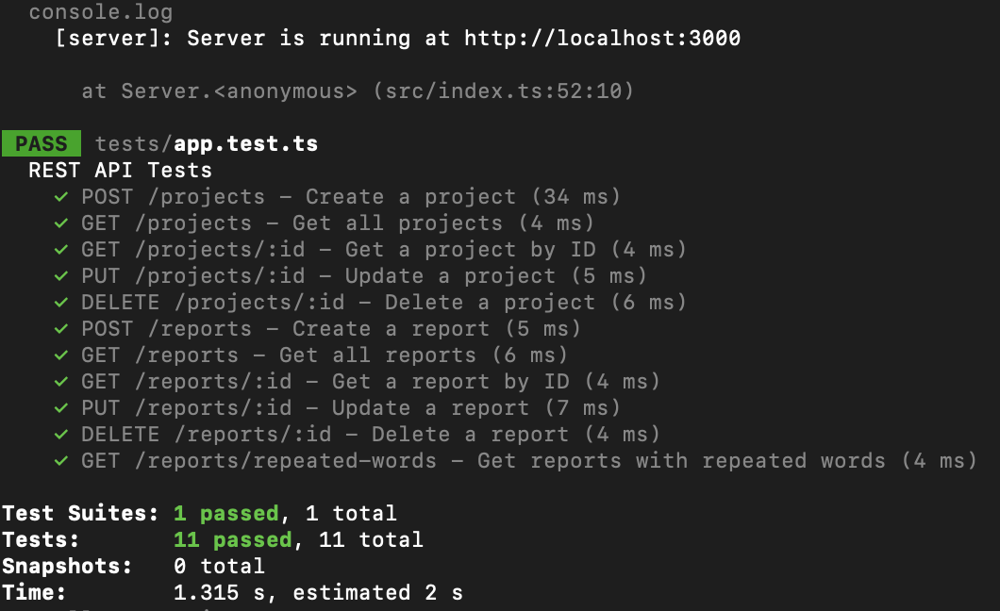
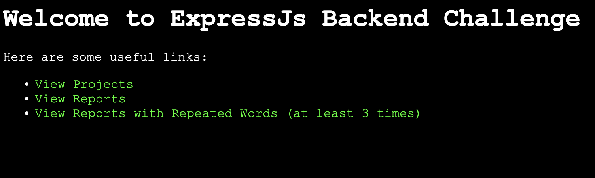

# DPS Backend Coding Challenge

## Developer's Note

The project can be tested with Jest and Supertest. If you don't have it yet, install it first (commands can look different depending on the OS, this was tested in MacOS)

```
npm install --save-dev ts-jest @types/jest
```
Run the server and execute the test. It will execute `tests/app.test.ts`
```
npx jest
```
The output should look like:



While the server is running, a welcome page is also accessible at http://localhost:3000/?auth=Password123



The endpoints are organized as follows:
```
Root Endpoint (/)

Projects Endpoints (/projects)
POST    /projects       Creates a new project.
GET     /projects       Retrieves all projects.
GET     /projects/:id   Retrieves a specific project by its ID.
PUT     /projects/:id   Updates a project by its ID.
DELETE  /projects/:id   Deletes a project by its ID.

Reports Endpoints (/reports)
POST    /reports                    Creates a new report.
GET     /reports                    Retrieves all reports.
GET     /reports/repeated-words     Retrieves reports where a word appears at least three times (this route is checked before other report-specific routes).
GET     /reports/:id                Retrieves a specific report by its ID.
PUT     /reports/:id                Updates a report by its ID.
DELETE  /reports/:id                Deletes a report by its ID.
```

---
Template's original README is kept below for documentation.
## Overview

This repository contains a very basic web application based on Typescript and Express.js. Main application file is `index.ts`. Node and npm are required.

## Environment Setup

Ensure you have Node.js (v14.x or later) and npm (v6.x or later) installed.  
To set up and run the application, execute the following commands:

```
npm install
npm run dev
```

The application will then be accessible at http://localhost:3000.

## Project Context

You will develop a backend system for managing data about a company's projects and their associated reports. Each project may have multiple reports linked to it, though having reports is not mandatory. Start your implementation using the provided SQLite database([db/db.sqlite3](./db/db.sqlite3)).

Refer to the database schema provided for understanding the data structure 👇


NOTE: You can use ([db.service.ts](./src/services/db.service.ts)) to handle SQL queries to the database.

## Challenge Tasks

-   **Fork this project:** Start by forking this repository
-   **REST API Development:** Design and implement a RESTful API to create, read, update, and delete projects and their reports.
-   **Special API Endpoint:** Create an API endpoint that retrieves all reports where the same word appears at least three times.
-   **Optional:** Secure all API routes with a hardcoded authentication token ("Password123").
-   **Submission:** After completing the challenge, email us the URL of your GitHub repository.
-   **Further information:**
    -   If there is anything unclear regarding requirements, contact us by replying to our email.
    -   Use small commits, we want to see your progress towards the solution.
    -   Code clean and follow the best practices.

\
Happy coding!
